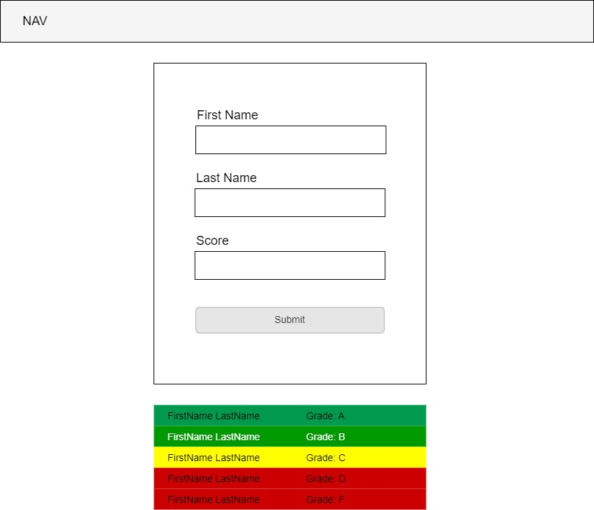

# Gradebook Assistant - Part 1 - Manipulating the DOM

## Assignment

Your task is to build a front-end application using HTML, CSS, and JavaScript. This application will act as a tool that a teacher could use to track and sort the grades from a classroom test. Over time, you will continuosly build upon this application by adding new features and improving old ones.

In part one, you will build a basic, non-functional nav bar, a form, and a container for storing the submitted grades.

The form will allow you to submit a students first name, last name, and test score. Once submitted, the score should be converted to a letter grade, then rendered to the screen in order. You can base your design on the wireframe below, but feel free to improvise and polish your design.



## User Story

```md
AS A teacher
I WANT a virtual gradebook
SO THAT I can easily store and sort student test scores
```

## Requirements

```md
GIVEN a front-end application that takes student test scores
WHEN I input a students first name, last name, and test score
THEN the students first name, last name, and converted letter
grade is displayed on the screen with the appropriate background color,
displayed in order from highest to lowest grades
```

## Recommended Documentation

### Forms

- [HTML Forms](https://www.w3schools.com/html/html_forms.asp)
- [Form Validation](https://www.w3schools.com/js/js_validation.asp)

### DOM manipulation & Array Methods

- [Create Element](https://www.w3schools.com/jsref/met_document_createelement.asp)
- [forEach](https://developer.mozilla.org/en-US/docs/Web/JavaScript/Reference/Global_Objects/Array/forEach)
